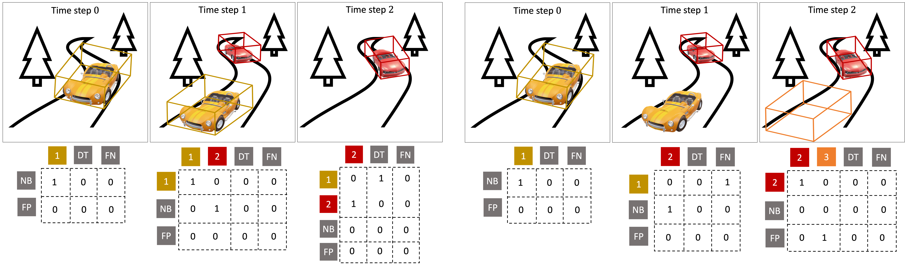

# ShaSTA: Modeling Shape and Spatio-Temporal Affinities for 3D Multi-Object Tracking

  

> [**ShaSTA: Modeling Shape and Spatio-Temporal Affinities for 3D Multi-Object Tracking**](https://arxiv.org/abs/2211.03919),            
> Tara Sadjadpour, Jie Li, Rares Ambrus, Jeannette Bohg,        
> *arXiv technical report ([arXiv 2211.03919](https://arxiv.org/abs/2211.03919))*  

    @article{sadjadpour2023shasta,
      title={Shasta: Modeling shape and spatio-temporal affinities for 3d multi-object tracking},
      author={Sadjadpour, Tara and Li, Jie and Ambrus, Rares and Bohg, Jeannette},
      journal={IEEE Robotics and Automation Letters},
      year={2023},
      publisher={IEEE}
    }

If you enjoy this work and are interested in multi-modal perception with camera-LiDAR fusion, please also see our follow-up work [ShaSTA-Fuse: Camera-LiDAR Sensor Fusion to Model Shape and Spatio-Temporal Affinities for 3D Multi-Object Tracking](https://arxiv.org/abs/2310.02532).

# Highlights
- **Simple:** Two sentences method summary: ShaSTA models shape and spatio-temporal affinities between tracks and detections in consecutive frames. By better understanding objects’ shapes and spatio-temporal contexts, ShaSTA improves data association, false-positive elimination, false-negative propagation, newborn
initialization, dead track termination, and track confidence refinement.

- **Fast and Accurate**: Our best model achieves *69.6* AMOTA on nuScenes, ranking 1st amongst trackers using CenterPoint detections. 

- **Extensible**: Simple framework for affinity-based 3D multi-object tracking in your novel algorithms.

# Main Result 
#### 3D Tracking on nuScenes test set 

|          | AMOTA ↑ | AMOTP ↓ |
|----------|---------|---------|
| ShaSTA |   69.6      |  0.540       |

# Docs
## Environment Setup
For reproducing our environment setup, please see [ENV_SETUP.md](docs/ENV_SETUP.md).

## Data
For getting the nuScenes data and obtaining our pre-processed data, please see [DATA.md](docs/DATA.md).

## Reproduce Results and Extensions
For running our pre-trained models to reproduce our results, or training and evaluating your own models with this framework, please see [MODELS.md](docs/MODELS.md). We also include a link to download our validation tracking results that were reported in the paper. 

## Visualization
We provide a helpful script for visualizing your results through two views: (1) top-down view with LiDAR point clouds projected onto the road map, and (2) front camera view with 3D boxes projected onto the scene. These two views are used in the qualitative results we show in our [video demo](https://youtu.be/nWR48ws7ns8).

Please see [VISUALIZE.md](docs/VISUALIZE.md). We highly recommend using our visualization tool for your tracking project to obtain qualitative results both for the development stage of your project and for publication. Please cite our repo if you find this helpful. 

## License

ShaSTA is released under the Creative Commons Non-Commercial License (see [LICENSE](LICENSE)). It is developed based on a forked version of [CenterPoint](https://github.com/tianweiy/CenterPoint). We also incorperate preprocessing code from [SimpleTrack](https://github.com/tusen-ai/SimpleTrack). Note that nuScenes is released under a non-commercial license. 

## Acknowlegement
This research was funded by the Toyota Research Institute. 

This project is not possible without multiple open-source codebases. We list some notable examples below.  
* [CenterPoint](https://github.com/tianweiy/CenterPoint)
* [SimpleTrack](https://github.com/tusen-ai/SimpleTrack)
